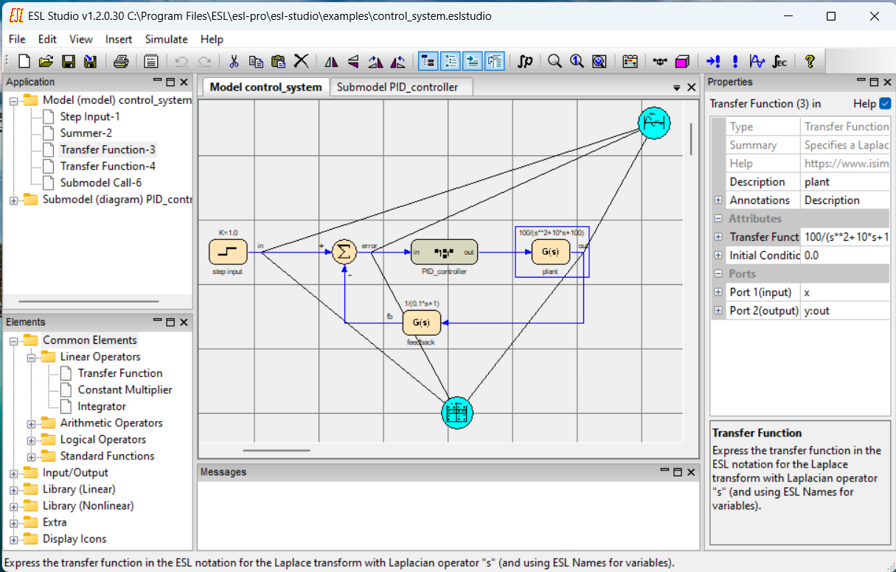
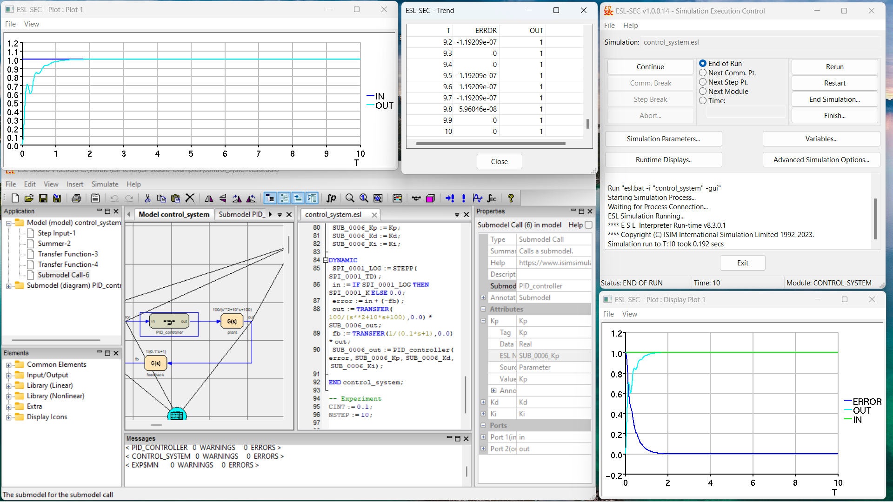

Overview of ESL-Studio
======================

ESL-Studio is a desktop application to allow you to develop an ESL
simulation which is expressed in an ESL-Studio application and may be
saved as an `.eslstudio` file.

Window Layout
-------------

ESL-Studio is organised in a common desktop application style as a
window with a menu-bar and toolbar, and a central "main view area"
which can contain different "views". They can be selected with "tabs"
at the top of the main view area. The main view area may be split to
show views side by side, if desired, but they are always in the main
view area. These views are primarily used to represent or model the
simulation, for example as block diagrams, ESL code, package variable
definitions and simulation parameter values.

The standard menu on the window menu-bar is detailed
[here](std-menu.md). The standard toolbar provides short-cuts for
most of the menu items.

There are also secondary views or "panes" primarily used for
information or editing. They may be docked in various locations round
the main view area, or floated free (as secondary windows).
The main panes are:

-	Application pane - this shows the structure of the simulation
	application - including the simulation entity objects in diagrams
-	Elements pane - presents a structured menu of available simulation
	entities that may be put in the the diagrams
-	Properties pane - the properties of what may be selected - for
	instance a Model or Submodel for a diagram view, or specific properties
	for a selected simulation entity object
-	Messages pane - an area that will show information or errors as the
	simulation application is being developed

There are also occasions when ESL-Studio will open a "modal dialog" (a
window that has to be closed to let you continue) in order to let you
enter information required by the current operation. For example to
open or save a file, for printing settings, or for ESL-Studio
preferences or options settings.

This image shows the standard layout for ESL-Studio - while editing
an application.

Creating a Simulation Application
---------------------------------

The basic structure of a simulation application normally consists of:

-	a main model, represented by a block diagram, which will correspond to
	the ESL MODEL when the the simulation's ESL code is generated
-	graphical submodels, which are also represented by block diagrams and
	generate ESL SUBMODEL code
-	textual submodels, represented directly in ESL code

ESL Studio always has a diagram view for the main model. The Insert
menu has entries to allow you to create new submodel diagram or textual
submodel views for your application.

Other components of a simulation application include Packages (which generate
ESL PACKAGEs) and the set of Simulation Parameter values (to be set initially
when running the simulation).

###	Developing a block diagram

When you have a diagram selected in the main view area you can add
[simulation entities](std-entities.md) to it from the tree view in
the Elements pane. You select an entry and drag it across to the
desired location in the diagram (or double click to send it to the
centre of the view).

There is also a set of simulation entities, and other graphical
objects, which may be inserted via the context menu, obtained by a
right mouse click, on the diagram background.

**Note:** The ESL User Guide and Tutorial document, available on the
[ESL Software website documents page](https://www.isimsimulation.com/documents/),
covers developing block diagrams in Chapters 2 and 3.

#### Connecting simulation entities with signal lines

Most simulation entities have "ports" which are where signal lines can
be connected. These correspond to ESL data types (Real, Integer,
Logical) and may be for input to or output from the simulation entity.

To make a connection, select a simulation entity connection port (at
the end of its stem), with a left mouse click, to see a signal line
extend tracking the pointer as you move the mouse.

To join it to another simulation entity complete the connection on the
destination port with another left click. ESL-Studio will check that
the connection is valid and if so you will see a slight flash of the
connection port when the signal line is properly connected to it.

If, while extending the signal line, you left click on the diagram
background, this will establish a node on the diagram - but continue
extending the signal line from there.

Signal lines started in error can be abandoned by a right mouse click.

Signal line nodes on the diagram background are additional connection
points, and subsequently a signal line extending from a later
simulation entity may connect to the node, so long as the signal
connection would be valid.

Existing signal lines and nodes can be removed through their
appropriate context menu (obtained with a right mouse click on the
object).

**Tip**: In general, if you make any mistakes editing in ESL-Studio,
the most straightforward way to get back is to Undo those changes in
the undo/redo stack. This can be done via the Edit > Undo menu, or by
clicking the equivalent toolbar icon, or, in a diagram, the key
combination Ctrl-Z.

#### Setting properties for objects on the diagram

Most objects on a diagram have properties, which will appear in the 
Properties pane when the object has been selected in the diagram (for 
example by left mouse clicking on the object).

**Note:** If you click on the diagram background the Properties pane
will show properties for the ESL model or submodel being represented by
the diagram view.

A simulation entity may have a set of properties for its "Attributes" -
values which control how the simulation entity behaves in the running
simulation (by generating the appropriate ESL code for the simulation
entity).

A simulation entity will also have a set of structured properties for
its "Ports" - values relating to how the simulation entity connects,
via signal lines to other simulation entities, and include setting a
specific ESL name, for an output port (to be used in the generated
ESL).

Many properties, or components of structured properties, support
"Annotations". These allow you to specify the property or component to
be displayed on the diagram near the graphical object it refers to. You
simply check (click in the check-box) for the annotation and the text
for it will appear in a default location on the diagram. You may move
it by double clicking on the annotation text to select it and then you
may drag the text to a new position (relative to the object it refers
to) holding the left mouse button down on it and moving the text with
the pointer till you release the mouse button.

#### Input and Output Arguments

There are a set of Input and Output Argument simulation entities used to
define the inputs and outputs for graphical (diagram) submodels.

Their "Tag-name for input" or "Tag-name for output" ("TAG") attribute 
value will correspond to the ESL tag name for the submodel input or 
output in the submodel "signature", that is the ESL SUBMODEL 
declaration specifying the argument types and local names).

Input Arguments have the (boolean) attribute called "Attribute"
("ATTR") which may be checked to specify that the input argument will
be 'CONSTANT' in ESL and thus be an attribute for a Submodel Call for
this Submodel, rather than an input port if "Attribute" is unchecked.

**Note:** You may also use Input and Output Arguments in the diagram
for the main model, in which case the default ESL generation is for
READ and PRINT statements in the generated Experiment corresponding to
the arguments. You may, alternatively, specify your own Experiment for
the model to call the the generated ESL MODEL with the desired values.
ESL-SEC will prompt you for values for READ statements when invoked
when Started or Restarted and print a message for PRINT statements when
the simulation is expressly Ended or Finished.

#### Submodel Calls

A Submodel Call is special kind of simulation entity. It allows you to
specify an instance of a submodel - which will later be a call to that
submodel in the generated ESL code. When you have inserted a Submodel
Call into the diagram, or otherwise select it, its properties, in the
Properties Pane, include the "Submodel" property - initially blank.
This has a 'drop-down box' from which you may select from the set of
submodels (graphical (diagram) or textual) that have been defined in
the application.

When the Submodel property is assigned, the Submodel Call's appearance
and properties, attributes and ports, are updated to reflect the
"signature" of the submodel.

#### Display Icons

There is a set of Display Icon simulation entities, Plot, Table &
Prepare, which are used to set up displays - runtime plots, tables
("Trend" or "Monitor" style, or to a "tabulate" file) and "prepare"
files (which record the data accurately (in binary) from runs of the
simulation).

You specify the data items for the display by clicking on the centre of
a display icon object, and an instrumentation line will extend. This
can be processed in a similar way to signal lines, but you connect it
(directly or indirectly) to a signal line output port of a normal
simulation entity.

Properties for display icons include giving it a Title, specifying the
Update rate for the display when the simulation is running, and, for
Plot, specifying how the axes should be setup.

###	Developing a textual submodel

When you insert a textual submodel you choose between two types:

-	The Insert > Textual Submodel > ESL menu item is used to create a new
	editable text view in the main view area, initially set with very
	basic ESL code. You may edit the code in the view using standard
	text editing operations. You may commit the code being edited into
	the application via the context menu in the text view, and, in any
	case code changes will be committed when you move the mouse pointer
	away from the text view. When the commit takes place ESL-Studio
	performs basic validation of the submodel "signature" and may show
	errors or warnings in the Messages pane. For severe errors it will
	reject the changes, for less severe issues it does not prevent the
	edits being committed. This will allow you to commit invalid
	code which you plan to 'tidy up' later. 
	Of course, any such code that remains when the simulation is going
	to be run may fail in ESL generation or compilation stages.

-	The Insert > Textual Submodel > File menu item creates a new text view
	which is not editable when you assign an existing file to import
	its contents into the application. ESL-Studio reads and processes
	the file looking for ESL submodel code. The last such submodel will
	be the name for the textual submodel in the application.

**Note:** The ESL User Guide and Tutorial document, available on the
[ESL Software website documents page](https://www.isimsimulation.com/documents/),
covers developing textual submodels in Chapter 4.

Running the Simulation
----------------------

To run the simulation for your application select the Simulate > Run
Simulation menu item (or press the toolbar run icon).

By default, ESL-Studio (which will ask to save any uncommitted edits)
will generate the ESL code for your application. It will then run the
ESL compiler and interpreter. Of course, if it encounters any errors in
any of these steps, ESL-Studio will put the appropriate messages in the
Message pane and you can go back to editing the application.

If successful, ESL-Studio will invoke the ESL-SEC (Simulation Execution
and Control) program. This has many features to setup more displays (in
addition to any defined in the ESL-Studio application) and to monitor
simulation variables and step through the simulation.

Refer to the [ESL-SEC help page](esl-sec.md) for details on how to 
control the simulation - for example to step through the integration 
steps - and examine an modify ESL variables in the simulation, and to 
set up runtime displays such as plots or "prepare" files which may be 
used in post run analysis.

Post Run Analysis
-----------------

You may have accumulated a set of recorded data, after you have run a
number runs of simulations (with varied parameter values) or
different invocations of the application (trying out various
modifications), or, indeed completely different simulations (which may
have some relationship to be investigated).

The recorded data may be in the form of display files, such as accurate 
(binary) "prepare" files (generated from the ESL PREPARE statement or 
recorded when running a simulation with the ESL-SEC program), or 
"tabulate" format files (for example generated from the ESL TABULATE 
statement or recorded via ESL-SEC, or from other data that has been 
converted to that format).

**Note:** Prepare files retain full computer precision of data saved
whereas in tabulate files precision is limited to the number of
significant figures recorded textually.

The ESL-Displays program supports post run analysis and allows you to
flexibly investigate and explore the data visually by composing plots
across different data-sets.

Refer to the [ESL-Displays help page](esl-displays.md) for details -
for example for loading display files and specifying plots.
