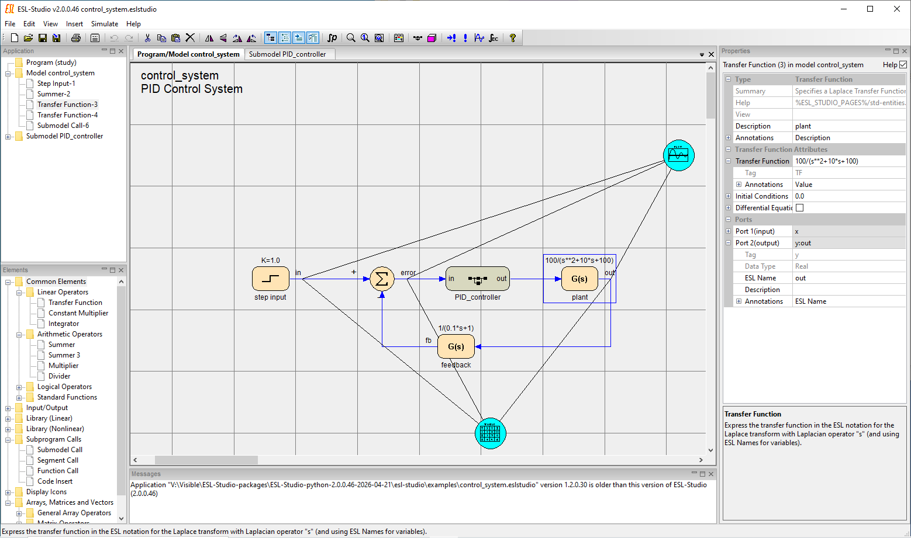
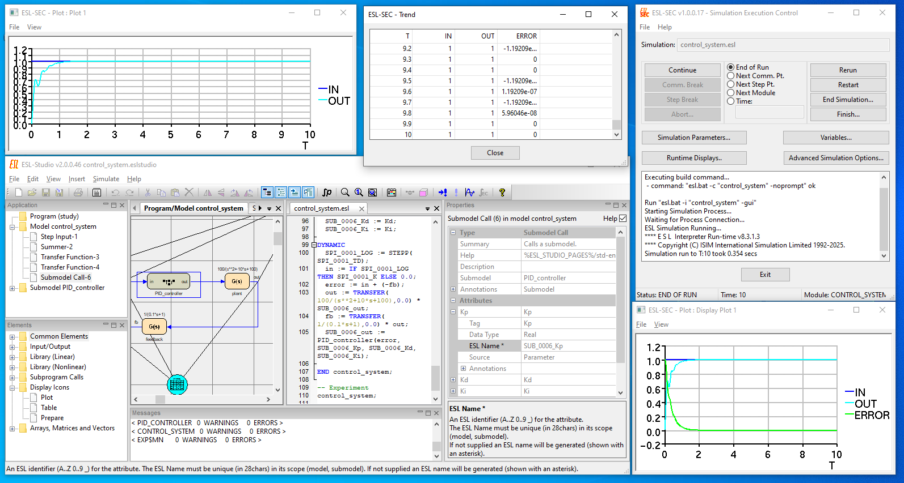

Overview of ESL-Studio
======================

ESL-Studio is a desktop application to allow you to develop an ESL
simulation which is expressed in an ESL-Studio application and may be
saved as an `.eslstudio` file.

Window Layout
-------------

ESL-Studio is organised in a common desktop application style as a
window with a menu-bar and toolbar, and a central "main view area"
which can contain different "views". They can be selected with "tabs"
at the top of the main view area. The main view area may be split to
show views side by side, if desired, but they are always in the main
view area. These views are primarily used to represent or model the
simulation, for example as block diagrams, ESL Simulation Language code,
package variable definitions and simulation parameter values.

The standard menu on the window menu-bar is detailed
[here](std-menus.md). The standard toolbar provides short-cuts for
most of the menu items.

There are also secondary views or "panes" primarily used for
information or editing. They may be docked in various locations round
the main view area, or floated free (as secondary windows).
The main panes are:

-	Application pane - this shows the structure of the simulation
	application - including the simulation entity objects in diagrams
-	Elements pane - presents a structured menu of available simulation
	entities that may be put in the diagrams
-	Properties pane - the properties of what may be selected - for
	instance a Model or Submodel for a diagram view, or specific
	properties for a selected simulation entity object
-	Messages pane - an area that will show information or errors as the
	simulation application is being developed

There are also occasions when ESL-Studio will open a "modal dialog" (a
window that has to be closed to let you continue) in order to let you
enter information required by the current operation. For example to
open or save a file, for printing settings, or for ESL-Studio
preferences or options settings.

This image shows the standard layout for ESL-Studio - while editing
an application.

Creating a Simulation Application
---------------------------------

The basic structure of a simulation application normally consists of:

-	a main model view, represented by a block diagram, comprising
	a Program and Model, which will normally correspond to an
	ESL STUDY and ESL MODEL when the simulation's ESL code is
	generated
-	graphical subprograms (Submodel or Segment), which are also
	represented by block diagrams and generate ESL SUBMODEL or SEGMENT
	code
-	textual subprograms, represented directly in ESL code

ESL Studio always has a diagram view for the main model. The Insert
menu has entries to allow you to create new subprogram diagram or
textual subprogram views for your application.

Other components of a simulation application include Packages (which
generate ESL PACKAGEs) and the set of Simulation Parameter values for a
Model (to be set initially when running the ESL MODEL in the
simulation).

!!! note
	Terms for something in ESL-Studio, normally given in title case,
	which correspond to something in the ESL Simulation Language, then
	that is then normally given in capitals.

	For example, in ESL-Studio, a Model is represented by a diagram
	view, containing connected simulation elements, and with a set of
	properties, which correspond to an ESL MODEL subprogram code block.

###	Developing a block diagram

In addition to the initial main model view, you can insert diagram 
subprogram views from the main menu. Usually you will Insert > Submodel 
to insert a new (blank) Submodel diagram. There are also Insert > Model 
(as a Study Program can have more than one Model), and Insert > Segment 
to insert the appropriate subprogram diagram.

When you have a diagram selected in the main view area you can add
[simulation entities](std-entities.md) to it from the tree view in
the Elements pane. You select an entry and drag it across to the
desired location in the diagram (or double click to send it to the
centre of the view).

There is also a small set of simulation entities, and other graphical
objects, which may be inserted via the context menu, obtained by a
right mouse click, on the 
[diagram background](std-menus.md#diagram-background-context-menu).

!!! note
	The ESL User Guide and Tutorial document, available on the
	[ESL Software website documents page](https://www.isimsimulation.com/documents/),
	covers developing block diagrams in Chapters 2 and 3 (for ESL-Studio
	1.2.0.30).

#### Connecting simulation entities with signal lines

Most simulation entities have "ports" which are where signal lines can
be connected. These correspond to ESL data types (Real, Integer,
Logical) and may be for input to or output from the simulation entity.
Non-scalar ports and signal lines also have a dimensionality, and can
connect to ports with compatible dimensionality.

To make a connection, select a simulation entity connection port (at
the end of its stem), with a left mouse click, to see a signal line
extend tracking the pointer as you move the mouse.

To join it to another simulation entity complete the connection on the
destination port with another left click. ESL-Studio will check that
the connection is valid and if so you will see a slight flash of the
connection port when the signal line is properly connected to it.

If, while extending the signal line, you left-click on the diagram
background, this will establish a node on the diagram - but continue
extending the signal line from there.

!!! tip
	Signal lines started in error can be abandoned by a right mouse
	click.

Signal line nodes on the diagram background are additional connection
points, and subsequently a signal line extending from a later
simulation entity may connect to the node, so long as the signal
connection would be valid.

Existing signal lines and nodes can be removed through their
appropriate context menu (obtained with a right mouse click on the
object).

!!! tip
	In general, if you make any mistakes editing in ESL-Studio, the
	most straightforward way to get back is to Undo those changes in
	the undo/redo stack. This can be done via the Edit > Undo menu, or
	by clicking the equivalent toolbar icon, or, in a diagram, the key
	combination Ctrl-Z.

#### Setting properties for objects on the diagram

Most objects on a diagram have properties, which will appear in the
Properties pane when the object has been selected in the diagram (for
example by left mouse clicking on the object).

!!! note
	If you click on the diagram background the Properties pane will
	show properties for the subprogram being represented by the diagram
	view.

A simulation entity may have a set of properties for its "Attributes" -
values which control how the simulation entity behaves in the running
simulation (by generating the appropriate ESL code for the simulation
entity).

!!! tip
	Attributes have a "Tag" component, usually a short fixed text, that
	identifies the attribute, and forms part of the ESL variable name
	that it corresponds to in the generated ESL code. This may be
	helpful in tracking down problems with ESL code generation,
	compiling and running.

A simulation entity will also have a set of compound properties for
its "Ports" - values relating to how the simulation entity connects,
via signal lines to other simulation entities, and include setting a
specific ESL name, for an output port (to be used in the generated
ESL).

Many properties, or components of compound properties, support
"Annotations". These allow you to specify the property or component(s) to
be displayed on the diagram near the graphical object it refers to.
For example the Description of a simulation entity, or the ESL name for
an output port.
You simply check (click in the checkbox) for the annotation and the text
for it will appear in a default location on the diagram. You may move
it by double-clicking on the annotation text to select it, and then you
may drag the text to a new position (relative to the object it refers
to) holding the left mouse button down on it and moving the text with
the pointer till you release the mouse button. You may also change the
text properties such as font and colour.

The properties are covered in more detail [here](properties.md).

#### Input and Output Arguments

There is a set of Input and Output Argument simulation entities used to
define the inputs and outputs for diagram subprograms.

The "Arg Name" (Tag "ARG") attribute value will correspond to the ESL
argument variable name, when the ESL code is generated, for the
subprogram inputs and outputs in the subprogram "signature", that is
the ESL declaration specifying the argument types and their local
names. If it is left unset, ESL-Studio will use a generated ESL name
for the variable formed from the identification of the simulation
entity.

Input and Output Arguments for Submodel and Segment subprograms will 
normally be realised as Ports for a subprogram Call simulation entity 
(on another subprogram diagram), when the Call is set for this 
submodel.

Input Arguments have the (boolean) attribute called "Attribute" (Tag 
"ATTR") which may be checked to specify that the input argument will be 
'CONSTANT' in ESL and thus be an attribute for a subprogram Call for 
this subprogram, rather than an input port if "Attribute" is unchecked.

!!! note
	You may also use Input and Output Arguments in the diagram for the 
	main model, in which case the default ESL generation is for READ 
	and PRINT statements in the generated Experiment corresponding to 
	the arguments. You may, alternatively, specify your own Experiment 
	for the Program to call the generated ESL MODEL with the desired 
	values. ESL-SEC will prompt you for values for READ statements when 
	invoked when Started or Restarted and print a message for PRINT 
	statements when the simulation is expressly Ended or Finished.

#### Subprogram Calls

A subprogram Call is special kind of simulation entity - there are
three such Calls: Submodel Call, Segment Call and Function Call.
A subprogram Call allows you to specify an instance of a subprogram
(Submodel, Segment or Function) which will later be a call to that
subprogram in the generated ESL code.

When you have inserted a subprogram Call into the diagram, or selected
it, its properties, in the Properties Pane, include the appropriate
subprogram property - initially blank. This has a "drop-down" list from
which you may select from the set of subprograms of that type, which
may be diagram or textual subprograms, that have been defined or
imported in to the application.

When the subprogram property is assigned, the subprogram Call's
appearance and properties, attributes and ports, are updated to reflect
the "signature" of the subprogram.

!!! note
	A Function cannot be defined by a diagram, and can only be
	incorporated (imported or inserted) as ESL code.
	It corresponds to an ESL PROCEDURE which has a RETURN type declared
	in its "signature".

#### Display Icons

There is a set of Display Icon simulation entities, Plot, Table &
Prepare, which are used to set up displays - runtime plots, tables
("Trend" or "Monitor" style, or to a "tabulate" text file) and "prepare"
files (which record the data accurately (in binary) from runs of the
simulation).

You specify the data items for the display by clicking on the centre of
a display icon object, and an instrumentation line will extend. This
can be processed in a similar way to signal lines, but you connect it
(directly or indirectly) to a signal line output port of a normal
simulation entity.

Properties for display icons include giving it a Title, specifying the
Update rate for the display when the simulation is running, and, for
Plot, specifying how the axes should be setup.

### Incorporating textual ESL code

The normal way you would incorporate textual ESL code into an
ESL-Studio application is by importing one or more subprograms.
This is done by inserting a Textual Subprogram(s) view in the main view
area and there are two options for this, ESL Import, for entering the
ESL code directly into the application, or File Import for linking to
an existing file containing the code.

There may be special circumstances in which you need to include some
ESL code inserted into the code generated by a diagram subprogram.
This is done with the special Code Insert simulation entity.

#### Importing ESL code subprograms

The Insert > Textual Subprogram(s) > ESL Import menu item is used to
create a new editable text view in the main view area.
You may edit the code in the view using standard text editing
operations.
You can also open a basic text modal dialog to show or edit the code #
from the 'ESL' property for the view.

You may commit the code being edited into the application via the
context menu in the text view, and, in any case code changes will be
committed when you move the mouse pointer away from the text view.
When the commit takes place ESL-Studio performs basic code checks to
validate the submodel "signature" and may show errors or warnings in
the Messages pane. For severe errors it will reject the changes, for
less severe issues it does not prevent the edits being committed. This
will allow you to commit invalid code which you plan to 'tidy up'
later. Of course, any such code that remains when the simulation is
going to be run may fail in ESL generation or compilation stages.

The context menu in the ESL Text view has a number of options for
editing the code, and displaying it, and searching the text. It also
has options 'Show code checks' and 'Run ESL compiler'.
The 'Show code checks' option displays the output from the last run of
code checking. The 'Run ESL compiler' option, saves any changes and
does the basic code checks, and sends the text to the ESL compiler for
syntax checking. These options open (if not already) a small pane to
show the results.

#### Importing File subprograms

The Insert > Textual Subprogram(s) > File Import menu item is used to
create a new read-only text view in the main view area.
You can open a file selection dialog select an ESL file to be imported
as a whole. The basic code checks are run on contents of the file and
if accepted the contents are displayed in the text view.

The context menu in the ESL Text view does not support edit operations,
but has the options for displaying code, and searching the text as for
the ESL Import. It also the has options 'Show code checks' and 'Run ESL
compiler'.

#### Code Insert

The special Code Insert simulation entity allows you to plant ESL code 
in the code that is generated for the subprogram diagram. 
This may be wanted, for example, to integrate the diagram's code with 
an imported file (as when it is not possible or desirable to adapt it 
for this application).

A Code Insert simulation entity has special Code Insert properties to 
specify where to place the insert in the generated subprogram code 
(that is in what section - for example: in the declarations, or 
initialisation sections, or as procedural code in the dynamic or the 
"STEP" or "COMMUNICATION" regions).

The code is normally inserted at the end of the generated code region. 
For proper interoperation with generated code, it may be necessary to 
specify the insert position to be at the beginning.
The ESL code block to be inserted can be entered and edited by opening 
a basic text modal dialog.

A Code Insert simulation entity (in an appropriate region) may have 
output ports that may be connected with input ports to other simulation 
entities in the diagram subprogram. You specify the output types, and 
then set the ESL name for each such port, which is how it is identified 
in the inserted code.

### Packages

Packages are essentially named blocks of ESL variable definitions, 
which may be shared across other subprogram (diagram or textual).

Packages may be defined in ESL-Studio in a Package view, essentially by 
extending and filling in a form, or they may be defined and imported as 
textual ESL code blocks or in external files.

!!! tip
	We recommend that you do not mix ESL textual PACKAGEs and textual 
	subprograms in the same ESL code block (or file), as this may lead 
	to unexpected failures to determine the dependency order of the 
	code block.

The Insert > Package menu item is used to create a new Package view. It 
will assign it a unique ESL name, which you can edit to a more suitable 
ESL name.

A "plus" button lets you add a new default ESL Variable entry, with a 
set of properties, which you can expand and edit.

The Data Type property must be one of the basic ESL data-types: Real, 
Integer or Logical. The Kind of Variable property is one of Parameter, 
Constant or Variable corresponding to the ESL PARAMETER, and CONSTANT 
keywords for an ESL variable declaration and Variable for when neither 
keyword is wanted. A Constant variable can only have its initial value, 
it cannot be changed in a run of the simulation at all. A Parameter 
variable is similar to a Constant, but its value can be changed 
explicitly before a run of the simulation, for instance via the 
[ESL-SEC program](esl-sec.md). 

!!! note
	For a discussion of the Dimension and Value (an ESL Value) 
	properties see [here](properties.md#general-property-features).

A diagram subprogram declares it will use a package, and can refer 
directly to its variables, by checking its name in the Uses Packages 
properties selection box. A textual subprogram, similarly, specifies 
one or more Package names via the USES statement.

Running the Simulation
----------------------

You can set up how you want your application to run the simulation in 
the Setup view, which is available via the View > View Simulation Setup 
menu item. Options available in the Setup view include just generating 
code (not trying to run it) when the Run is invoked, and displaying the 
generated code in a (read-only) ESL Text view. It has options to 
specify complex build and run commands, but the usual (default) way is 
to compile the generated ESL code to an intermediate form and run the 
ESL interpreter.

To run the simulation for your application select the Simulate > Run
Simulation menu item (or press the toolbar run icon).

By default, ESL-Studio (which will ask to save any uncommitted edits)
will generate the ESL code for your application. It will then run the
ESL compiler and interpreter. Of course, if it encounters any errors in
any of these steps, ESL-Studio will put the appropriate messages in the
Message pane, and you can go back to editing the application.

!!! note
	ESL-Studio will not generate any subprograms that it does not call 
	from the main model or a subprogram called from that. It works out 
	the dependency order in which to generate the subprograms (or 
	blocks of textual subprograms) such that called items are declared 
	in the code before they are to be used.
	
	Also, in the case of simulation entities using arrays, matrices or 
	vectors, where ports and signal lines may not have fixed dimensions 
	for their dimensionality declaration, that is they are "generic" 
	and use the asterisk ('*') wildcard notation (for an arbitrary 
	number of elements in a given dimension) or dot-dot-dot ('...', for 
	an ellipsis) universal notation (for any number of dimensions, 
	1..3, and any number of elements), ESL-Studio generally has to 
	determine the precise dimensionality for the ESL variables in the 
	generated code.

!!! tip
	ESL-Studio will try to determine the dependency order and any 
	dimensionalities, using Call simulation entities, the connections 
	between simulation entities and various property settings. 
	
	Often errors occur in the compilation due to a missing connections. 
	
	Something that may determine the dependency order, particularly 
	between diagram generated code and textual imports, are missing 
	explicit LIBRARY references.
	
	Failure to fix dimensionalities can usually be resolved by an "upstream" 
	output port's 'Fix Dimensions' property.

If successful, ESL-Studio will invoke the ESL-SEC (Simulation Execution
and Control) program. This has many features to set up more displays (in
addition to any defined in the ESL-Studio application) and to monitor
simulation variables and step through the simulation.

Refer to [ESL-SEC - Simulation Execution Control](esl-sec.md) for 
details on how to control the simulation - for example to step through 
the integration steps - and examine and modify ESL variables in the 
simulation, and to set up runtime displays such as plots or "prepare" 
files which may be used in post run analysis.

Post Run Analysis
-----------------

You may have accumulated a set of recorded data, after you have run a
number of runs of simulations (with varied parameter values) or
different invocations of the application (trying out various
modifications), or, indeed completely different simulations (which may
have some relationship to be investigated).

The recorded data may be in the form of display files, such as accurate
(binary) "prepare" files (generated from the ESL PREPARE statement or
recorded when running a simulation with the ESL-SEC program), or
"tabulate" format files (for example generated from the ESL TABULATE
statement or recorded via ESL-SEC, or from other data that has been
converted to that format).

!!! note
	Prepare files retain full computer precision of data saved
	whereas in tabulate files precision is limited to the number of
	significant figures recorded textually.

The ESL-Displays program supports post run analysis and allows you to
flexibly investigate and explore the data visually by composing plots
across different data-sets.

Refer to [ESL-Displays - Post Run Analysis](esl-displays.md) for 
details - for example for loading display files and specifying plots.
