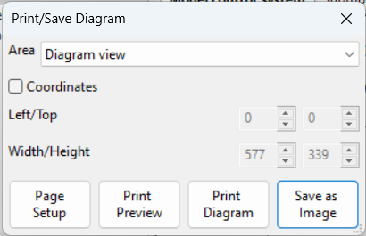
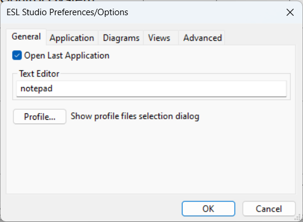
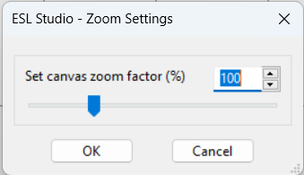

Standard Menu
=============

This section covers the ESL-Studio menubar menus with their menu items.

File
----
**New**														  			: Clears ESL-Studio to creates a new application 
**Open...**													  			: Lets you select and opens an existing ESL-Studio application 
**Save**														 		: Saves the ESL-Studio application with the current application
																		  filename 
**Save As...**												   			: Lets you select to save the ESL-Studio application with new
																		  application filename 
**Print/Save Diagram...**												: Opens the Print/Save Diagram dialog to let you define an
																		  area on the diagram to be printed or saved as an image 
 
**Page Setup...**														: Shows the standard Page Setup dialog to let you set the page
																		  settings for printing 
**Print Preview...**											 		: Shows a preview printout for the current diagram or text view 
**Print View...**														: Shows the standard Print dialog to set where to print the current
																		  diagram or text view 
**View Source File...**										  			: Lets you select to open a source (text) file for viewing 
**Open Text Editor...**													: Opens the external Text Editor (which may be specified in the Preferences/Options dialog) 
**Preferences/Options...**												: Opens the Preferences/Options dialog - this has tabs: General,
																		  Application, Diagrams, Views & Advanced 
 
**Application History >** 
-	**Clear Application History**										: Clears the history list of recent applications 
-	list of recently loaded `.eslstudio` application files				: Lets you to select one to reload into ESL-Studio 
**Exit**																: Exits ESL-Studio 

Edit
----
**Undo**																: Undoes the last editing action 
**Redo**																: Redoes the previously undone action 
**Cut**																	: Cuts the selection and moves it to the clipboard 
**Copy**																: Copies the selection to the clipboard 
**Paste**																: Pastes the clipboard contents onto the diagram 
**Delete**																: Deletes the current selection 
**Select All**															: Selects all objects 
**Flip >**	 
-	**Left/Right**														: Flips the selected diagram objects horizontally 
-	**Up/Down**															: Flips the selected diagram objects vertically 
**Rotate >**	 
-	**Left 90 Degrees**													: Rotates the selected diagram objects 90 degrees left 
-	**180 Degrees**														: Rotates the selected diagram objects 180 degrees 
-	**Right 90 Degrees**												: Rotates the selected diagram objects 90 degrees right 

View
----
**View Toolbar**														: Shows/hides the toolbar 
**View Application**													: Shows/hides the Application pane - tree view of the application 
**View Elements**														: Shows/hides the Elements pane - available simulation elements 
**View Messages**														: Shows/hides the Messages pane - the message display area 
**View Properties**														: Shows/hides the Properties pane 
**View Simulation Parameters**											: Shows/hides the model's Simulation Parameters view
																		  - they determine how the simulation will be run 
**View Simulation Setup**												: Shows/hides the simulation Setup view 
**Clear Messages**														: Clears the contents of the Messages pane 
**Zoom...**																: Opens the Zoom Settings dialog to allow you to change
																		  the diagram zoom factor 
 
**Zoom Reset**															: Resets diagram zoom factor to normal (100) 
**Zoom All**															: Zooms diagram to show all elements 
**Zoom Selected**														: Zooms diagram to show all selected elements 

Insert
------
**Submodel Diagram**													: Inserts a new submodel diagram view into the application 
**Textual Submodel >** 
-	**ESL**																: Inserts a new ESL textual submodel view into the application 
-	**File**															: Inserts a new file textual submodel view into the application 
**Package**																: Inserts a new variables package view into the application 

Simulate
--------
**Run Simulation**														: Builds and runs the ESL simulation for the application
																		  as defined in the Setup view - it should start ESL-SEC for
																		  the simulation (if so defined and application was valid
																		  - generated its ESL code and compiled OK) 
**View Simulation Setup**												: Shows/hides the simulation Setup view 
**Simulation Execution...**												: Launch ESL-SEC, to run another simulation 
**Post Run Analysis...**												: Launch the ESL-Displays for post run analysis 

Help
----
**ESL-Studio Help...**													: Displays the ESL-Studio Help Page (website) 
**ESL Help...**															: Displays the ESL Help file (installed locally) 
**ESL Documents...**													: Displays the ESL Documents (website) 
**Check ESL-Studio Updates...**											: Check for any updates to this version of ESL-Studio 
**Check ESL Updates...**												: Check for any updates to the current version of ESL 
**About...**															: Shows information about ESL-Studio (version & licence) 

Diagram Background Context Menu
===============================

This section covers the context menu for a diagram, for a right click
on the background.

**Paste**																: Pastes the clipboard contents onto the diagram 
**Insert Simulation Elements >** 
-	**Linear Operators >** 
-	-	**Insert Transfer Function**									: Insert a Transfer Function entity 
-	-	**Insert Constant Multiplier**									: Insert a Constant Multiplier entity 
-	-	**Insert Integrator**											: Insert an Integrator entity 
-	**Arithmetic Operators >** 
-	-	**Insert Summer**												: Insert a Summer entity 
-	-	**Insert Summer 3**												: Insert a Summer 3 entity 
-	-	**Insert Multiplier**											: Insert a Multiplier entity 
-	-	**Insert Divider**												: Insert a Divider entity 
-	**Insert Submodel Call**											: Insert a Submodel Call 
**Insert Basic Elements >** 
-	**Insert Rectangle**												: Insert a rectangle into the diagram 
-	**Insert Ellipse**													: Insert an ellipse into the diagram 
-	**Insert Line**														: Insert a line into the diagram 
-	**Insert Text**														: Insert text into the diagram 
-	**Insert Image**													: Insert an image into the diagram 
-	**Insert Polyline**													: Insert a polyline (open polygon) into the diagram 
-	**Insert Polygon**													: Insert a polygon into the diagram 
-	**Insert Spline**													: Insert a spline into the diagram 

Simulation Entity Context Menu
==============================

This section covers context menu for a (normal) simulation entity, for
a right click on the object in the diagram.

**Cut**																	: Cuts the object and moves it to the clipboard 
**Copy**																: Copies the object to the clipboard 
**Delete**																: Deletes the object 
**Select All**															: Selects all objects 
**Flip >**	 
-	**Left/Right**														: Flips the selected object horizontally 
-	**Up/Down**															: Flips the selected object vertically 
**Rotate >** 
-	**Left 90**										  					: Rotates the selected object 90 degrees left 
-	**180**																: Rotates the selected object 180 degrees 
-	**Right 90**														: Rotates the selected object 90 degrees right 
