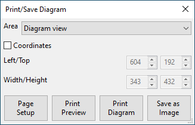
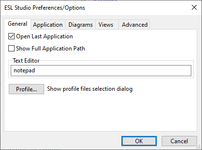
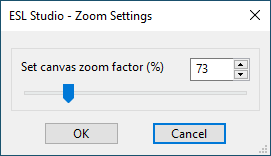

Standard Menus
==============

Standard Menubar
----------------

This section covers the ESL-Studio standard menubar menus with their menu items.

### File

| Menu label					| Operation |
| --- 							| --- |
| New							| Creates a new ESL-Studio application. |
| Open...						| Opens an existing ESL-Studio application. |
| Save							| Saves the current ESL-Studio application with the same filename. |
| Save As...					| Saves the current ESL-Studio application with a new filename. |
| Print/Save Diagram...			| Opens the Print/Save Diagram dialog to setup an area of the current diagram view to print or save as an image. |

| | |
| --- 							| --- |
| Page Setup...					| Opens the standard Page Setup dialog to set the page settings for printing. |
| Print Preview...				| Shows a preview printout for the current diagram or text view. |
| Print View...					| Shows the standard Print dialog to set where to print the current diagram or text view. |
| View Source File...			| Opens a source (text) file for viewing. |
| Open Text Editor...			| Opens the external Text Editor (specified in the Preferences/Options dialog). |
| Preferences/Options...		| Opens the Preferences/Options dialog This has tabs: General, Application, Diagrams, Views & Advanced. |

| | |
| --- 							| --- |
| Application History >			| |
| &emsp;&emsp;Clear Application History	| Clears the history list of recent applications. |
| &emsp;&emsp;list of recently loaded &emsp;&emsp;`.eslstudio` application files	| Lets you to select one to reload into ESL-Studio. |
| Exit							| Exits ESL-Studio. |

### Edit

| Menu label					| Operation |
| --- 							| --- |
| Undo							| Undoes the last editing action |
| Redo							| Redoes the previously undone action |
| Cut							| Cuts the selection and moves it to the clipboard |
| Copy							| Copies the selection to the clipboard |
| Paste							| Pastes the clipboard contents onto the diagram |
| Delete						| Deletes the current selection |
| Select All					| Selects all objects |
| Flip >						| |
| &emsp;&emsp;Left/Right			| Flips the selected diagram objects horizontally |
| &emsp;&emsp;Up/Down				| Flips the selected diagram objects vertically |
| Rotate >						| |
| &emsp;&emsp;Left 90 Degrees		| Rotates the selected diagram objects 90 degrees left |
| &emsp;&emsp;180 Degrees			| Rotates the selected diagram objects 180 degrees |
| &emsp;&emsp;Right 90 Degrees		| Rotates the selected diagram objects 90 degrees right |

### View

| Menu label					| Operation |
| --- 							| --- |
| View Toolbar					| Shows/hides the toolbar. |
| View Application				| Shows/hides the Application pane - the tree view of the application. |
| View Elements					| Shows/hides the Elements pane - the available simulation elements. |
| View Messages					| Shows/hides the Messages pane - the message display area. |
| View Properties				| Shows/hides the Properties pane - to edit current view or selection properties. |
| View Simulation Parameters	| Shows/hides the model's Simulation Parameters view - to determine the simulation execution mechanism. |
| View Simulation Setup			| Shows/hides the simulation Setup view - to determine how the simulation will be built and invoked. |
| Clear Messages				| Clears the contents of the Messages pane. |
| Zoom...						| Opens the Zoom Settings dialog - to change the diagram zoom factor. |

| | |
| --- 							| --- |
| Zoom Reset					| Resets the diagram zoom factor to normal (100%). |
| Zoom All						| Zooms the diagram to show all elements. |
| Zoom Selected					| Zooms the diagram to show all selected elements. |

### Insert

| Menu label					| Operation |
| --- 							| --- |
| Model Diagram					| Inserts a new model diagram view into the application. |
| Submodel Diagram				| Inserts a new submodel diagram view into the application. |
| Segment Diagram				| Inserts a new segment diagram view into the application. |
| Textual Subprograms(s) >		| |
| &emsp;&emsp;ESL Import			| Imports new ESL textual (code) subprogram(s) into the application. |
| &emsp;&emsp;File Import			| Imports new file textual (code) subprogram(s) into the application. |
| Package						| Inserts a new variables package view into the application. |

### Simulate

| Menu label					| Operation |
| --- 							| --- |
| Run Simulation				| Builds and runs the ESL simulation for the application as defined in the Setup view. If the application was valid (that is it generated its ESL code and compiled OK) it should start running the application in ESL-SEC (if that had been specified) or run it directly. |
| View Simulation Setup			| Shows/hides the simulation Setup view - to determine how the simulation will be built and invoked. |
| Simulation Execution...		| Launch the ESL-SEC program - to run another simulation. |
| Post Run Analysis...			| Launch the ESL-Displays program - for post run analysis. |

### Help

| Menu label					| Operation |
| --- 							| --- |
| ESL-Studio Help...			| Displays the ESL-Studio web-pages (website). |
| ESL Help...					| Displays the ESL Help file (installed locally). |
| ESL Documents...				| Displays the ESL Documents (ESL Software website). |
| Check ESL-Studio Updates...	| Checks ESL Software for any updates to this version of ESL-Studio. |
| Check ESL Updates...			| Checks ESL Software for any updates to the current version of ESL. |
| About...						| Shows information about ESL-Studio (version and licence). |

Diagram Background Context Menu
-------------------------------

This section covers the context menu for a diagram, for a right click
on the background.

| Menu label					| Operation |
| --- 							| --- |
| Paste							| Pastes the clipboard contents into the diagram. |
| Insert Simulation Elements >	| |
| &emsp;&emsp;Linear Operators >	| |
| &emsp;&emsp;&emsp;&emsp;Insert Transfer Function		| Insert a Transfer Function simulation entity into the diagram. |
| &emsp;&emsp;&emsp;&emsp;Insert Constant Multiplier	| Insert a Constant Multiplier simulation entity into the diagram. |
| &emsp;&emsp;&emsp;&emsp;Insert Integrator				| Insert an Integrator simulation entity into the diagram. |
| &emsp;&emsp;Arithmetic Operators >					| |
| &emsp;&emsp;&emsp;&emsp;Insert Summer					| Insert a Summer simulation entity into the diagram. |
| &emsp;&emsp;&emsp;&emsp;Insert Summer 3				| Insert a Summer 3 simulation entity into the diagram. |
| &emsp;&emsp;&emsp;&emsp;Insert Multiplier				| Insert a Multiplier simulation entity into the diagram. |
| &emsp;&emsp;&emsp;&emsp;Insert Divider				| Insert a Divider simulation entity into the diagram. |
| &emsp;&emsp;&emsp;&emsp;Insert Submodel Call			| Insert a Submodel Call simulation entity into the diagram. |
| Insert Basic Elements >		| |
| &emsp;&emsp;Insert Rectangle	| Insert a rectangle into the diagram. |
| &emsp;&emsp;Insert Ellipse	| Insert an ellipse into the diagram. |
| &emsp;&emsp;Insert Line		| Insert a line into the diagram. |
| &emsp;&emsp;Insert Text		| Insert text into the diagram. |
| &emsp;&emsp;Insert Image		| Insert an image into the diagram. |
| &emsp;&emsp;Insert Polyline	| Insert a polyline (open polygon) into the diagram. |
| &emsp;&emsp;Insert Polygon	| Insert a polygon into the diagram. |
| &emsp;&emsp;Insert Spline		| Insert a spline into the diagram. |

Simulation Entity Context Menu
------------------------------

This section covers context menu for a (normal) simulation entity, for
a right click on the object in the diagram.

| Menu label				| Operation |
| --- 						| --- |
| Cut						| Cuts the object and moves it to the clipboard. |
| Copy						| Copies the object to the clipboard. |
| Delete					| Deletes the object. |
| Flip >					| |
| &emsp;&emsp;Left/Right	| Flips the selected object horizontally. |
| &emsp;&emsp;Up/Down		| Flips the selected object vertically. |
| Rotate >					| |
| &emsp;&emsp;Left 90			| Rotates the selected object 90 degrees left. |
| &emsp;&emsp;180				| Rotates the selected object 180 degrees. |
| &emsp;&emsp;Right 90			| Rotates the selected object 90 degrees right. |
| Depth >					| |
| &emsp;&emsp;Bring to Front	| Bring the selected object to the front of other objects. |
| &emsp;&emsp;Raise Up			| Raise the selected object up one level (z-order) above the next. |
| &emsp;&emsp;Push Down			| Push the selected object down one level (z-order) below the next. |
| &emsp;&emsp;Send to Back		| Send the selected object to the back of other objects. |

!!! note
	For two selected objects, the context menu includes:

	| | |
	| --- 				| --- |
	| Swap depth orders	| Swap the depths (z-orders) of a selected pair of objects. |

ESL Text View Context Menu
--------------------------

This section covers the context menu for an ESL Text View, for a right 
click on in the text display area. 

| Menu label			| Operation |
| --- 					| --- |
| Commit ESL 			| Saves current edits in the ESL text into the application. |
| Show code checks		| Shows the most recent code checks in a validation pane. |
| Run ESL Compiler		| Runs the ESL Compiler on the current ESL text and shows the results in a validation pane. |
| Undo Edit				| Undoes the most recent text edit operation. |
| Redo Edit				| Immediately after an Undo re does the original text edit operation.  |
| Cut					| Cuts selected text and puts it in a local clipboard. |
| Copy					| Copies selected text into a local clipboard. |
| Paste					| Pastes the contents of the local clipboard in the text at the current text cursor position. |
| Delete				| Deletes selected text |
| Wrap					| Checkbox to toggle line wrap mode - to "soft" wrap long lines that would otherwise extend the width of the text view. |
| Folding 				| Checkbox to toggle whether folding blocks of source code is on or off. |
| Line Numbers 			| Checkbox to toggle display of line numbers in the text view. |
| White Space 			| Checkbox to toggle showing white space (blanks and tabs) with special visible characters in the view. |
| Select All			| Select all of the text. |
| Goto Line Number...	| Opens an entry box to let you specify a line number, and then move the text cursor, to the line. |
| Find Text...			| Opens an entry box to let you specify a string of text to search for, then find the it and set the text cursor there. It searches down from the current text cursor and wraps up to the top if not found below. |
| Find Next...			| Searches down below the text cursor for the next occurrence of the last search string.  |
| Find Previous...		| Searches up above the text cursor for the previous occurrence of the last search string. |

Variants of this view are also used for viewing and editing text files 
other than ESL (with the `.esl` extension), for instance application 
files (`.eslstudio`) or general `.txt` files.

The menu varies slightly depending on the type of text file, and whether 
editing is permitted and has been enabled.

| | |
| --- 				| --- |
| Edit				| Checkbox to toggle edit/read-only mode. |
| Save				| Save the edited text as by its current filename. |
| Save As...		| Select a new filename to save the current text. |
| Run ESL Direct	| Run the current text as an ESL source file (passes it to the ESL Compiler and Interpreter, if valid). |

!!! tip
	If you use the File > View Source File you can open an ESL file in 
	the ESL Text view and use the 'Run ESL Direct' context menu option 
	to pass the contents of the view to the ESL compiler and 
	interpreter to try to run it as a simulation. If the ESL compiles 
	successfully, the output of the simulation, including PRINT 
	statements, will be shown in the Message pane. As the simulation is 
	run in a background process - which has no console for to allow 
	text input you should avoid direct input, such as READ statements, 
	which ESL-Studio prevent and show:
	
		ESL text contains direct input - cannot run directly from ESL-Studio
		
	You can use this feature to enter an experimental STUDY program, 
	and use the 'Edit' context menu option to edit the text in the view 
	to try out various features of the ESL Simulation Language. The 
	file will not be changed automatically, but can be saved (as an 
	update of the file) or saved as a new file by the appropriate 
	context menu options.
